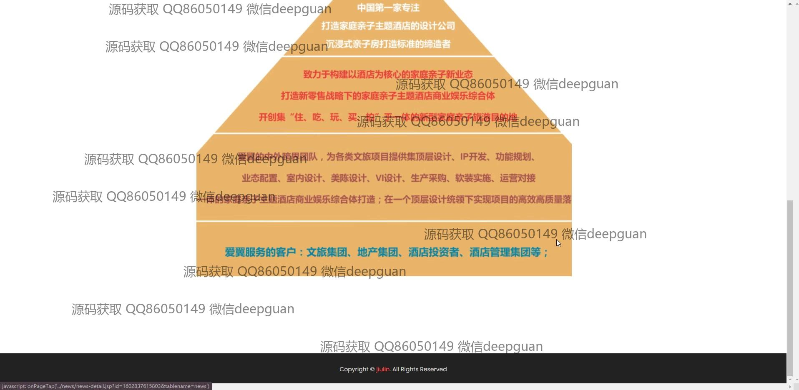
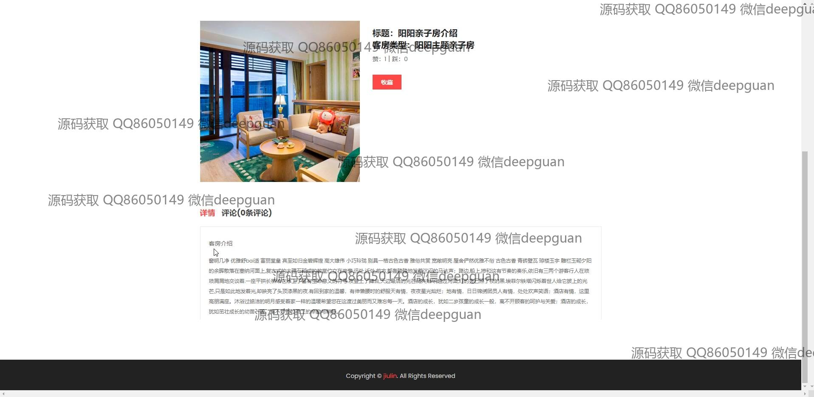
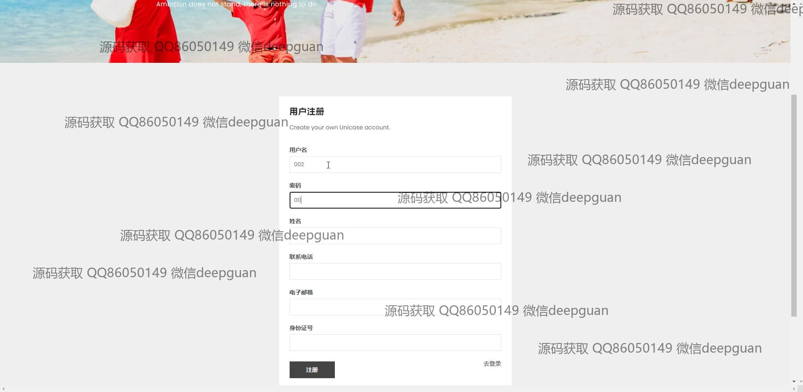

<h1 align="center">双子湾亲子酒店</h1>

## 简介
双子湾亲子酒店管理系统：角色分为管理员、用户；提供用户管理、客房管理、预订管理、活动管理、设备管理、财务管理等功能模块，支持多种支付方式与个人信息管理。    --计算机毕业设计源码；毕设源码；java毕业设计源码

## 联系方式

<h3 align="center">获取完整代码与数据库文件 + 微信：deepguan QQ: 86050149 QQ群: 783742310</h3>

<h3 align="center">可帮忙远程部署 包运行成功！提供远程部署、修改代码、设计文档指导、代码讲解等服务！</h3>

## 功能介绍（完整见运行截图）
管理员：主要负责系统的整体管理和维护，包括用户信息管理、客房信息管理、设备管理、亲子活动管理和景点周边信息管理等功能。可以通过左侧导航栏快速切换不同模块，提供添加、修改、删除等管理操作。财务管理页面则允许管理员查看和记录财务数据，支持功能，如添加、查看、修改和批量删除财务记录，以确保系统的有效运营和财务清晰。后台的管理界面设计直观，方便管理员进行各种数据的操作和维护。

用户：作为使用者，用户可以通过登录界面进入系统并注册新帐户，个人中心页面提供用户信息查看和修改功能，提升用户体验。在网站的各个功能页面，如客房预订页面，可以查看和预定客房信息，了解客房类型、价格和剩余数量，并进行在线支付操作。用户还可以参与各种亲子活动，通过页面的收藏和评论功能表达意见和建议，进一步丰富酒店的互动体验。网站设计注重功能性和用户友好性，为用户提供高效体验。

## 运行截图

本代码来源于网络,仅供学习参考使用!

